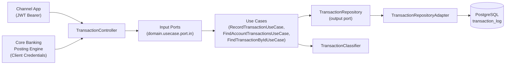
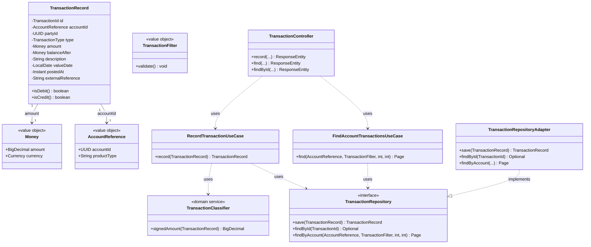
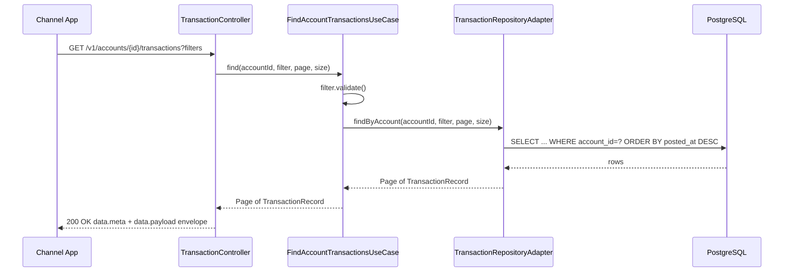

# transaction-log-service

## 1. Project Overview

| Field | Value |
|---|---|
| Project name | Client Transaction Log |
| Technical service name | `transaction-log-service` |
| BIAN Service Domain | **Current Account** (verified against the BIAN Service Landscape; Business Area: Operations & Execution → Business Domain: Account Management) |
| Business capability | Retrieval and recording of posted transaction lines against a current account |
| Business problem | Channel applications (mobile, web, branch assist) need a fast, paginated, filterable view of a customer's transaction history without querying the core ledger directly |
| Business actors | Channel application (consumer), Core Banking posting engine (producer of transaction events), Customer (indirect, via channel) |
| Project purpose | Establish the Clean Architecture skeleton — domain isolation, ports/adapters, JPA persistence, JWT resource server, the enterprise envelope/error model — with the lowest possible domain complexity, so every later project reuses this foundation instead of re-deriving it |

> **BIAN scope note.** The Current Account Service Domain in the full BIAN model owns the entire account lifecycle: opening, closing, standing orders, interest accrual, statement generation, and transaction posting. `transaction-log-service` deliberately implements **only the Retrieve behavior qualifier and a narrow Update(record) slice** of Current Account — it is a read-optimized transaction ledger, not the account of record. This is an intentional microservice-decomposition decision (see §3) so Project 1 stays proportionate to "imperative foundation" difficulty.

## 2. Business Context and Functional Scope

**Business scenario.** A customer opens their banking app and taps "Movements" on a current account. The channel calls `transaction-log-service` to retrieve the last N transactions, optionally filtered by date range, transaction type, or amount. Separately, whenever the core posting engine settles a movement against the account, it calls this service to append a transaction line to the read log.

**Actors.**
- **Channel application** — authenticated with a client-scoped JWT, queries transaction history on the customer's behalf.
- **Core Banking posting engine** — authenticated via OAuth2 Client Credentials, pushes new transaction lines as they are posted.
- **Customer** — never calls the API directly; always mediated by a channel.

**Main use cases.**
1. Record a newly posted transaction line for an account.
2. Retrieve a paginated, filtered list of transactions for an account.
3. Retrieve a single transaction by its identifier.

**Functional requirements.**
- FR1: Support filtering by `dateFrom`, `dateTo`, `transactionType`, `minAmount`, `maxAmount`.
- FR2: Support pagination (`page`, `size`, max size 100, default 20) with deterministic ordering (`postedAt DESC`).
- FR3: Reject duplicate ingestion of the same `externalReference` (idempotency).
- FR4: Return `404` for an unknown transaction ID or an account with zero transactions is a valid empty page, not a 404.

**Non-functional requirements.**
- NFR1: P95 read latency under 200 ms at up to 500 RPS.
- NFR2: All monetary fields use fixed-point decimal, never floating point.
- NFR3: No transaction description or amount appears in application logs beyond aggregate counters.

**Explicitly out of scope.** Account opening/closing, balance calculation authority (this service stores `balanceAfter` as reported by the ledger, it does not compute it), standing orders, interest, dispute/chargeback workflows, statement PDF generation.

## 3. Architecture and Learning Objectives

| Attribute | Value |
|---|---|
| Difficulty | Foundational |
| Classification | Imperative (Spring MVC, blocking JDBC via JPA) |
| Technologies | Java 21, Spring Boot 3, Spring MVC, Spring Data JPA, PostgreSQL, Spring Security (OAuth2 Resource Server), springdoc-openapi |
| Architectural concepts | Ports & adapters, dependency inversion, aggregate boundary discipline, idempotent ingestion |
| Java concepts | Records for value objects, `Optional`, `BigDecimal` for money, custom unchecked exceptions, Bean Validation |
| Spring concepts | Constructor injection, `@ControllerAdvice`, `@Valid`, Spring Data JPA repositories, `spring-boot-starter-oauth2-resource-server` |
| Clean Architecture concepts | Why `domain/` cannot import `org.springframework.*`, why the repository **interface** lives in domain and the **implementation** lives in infrastructure |
| Banking concepts | Current Account transaction posting semantics, debit/credit sign conventions, value date vs. posting date |
| Why this project exists in the progression | It is the only project in the portfolio with no reactive concerns at all — every architectural decision can be reasoned about without also reasoning about threading. Get the ports/adapters discipline right here, because every later project assumes it. |

**What I should understand before starting Project 2:** how to define an output port as a domain-owned interface and implement it in infrastructure without leaking JPA annotations into the domain; how the JWT resource server filter chain authorizes by scope; how the API envelope and global exception handler work end to end.

**Component / architecture diagram.**



## 4. Detailed Domain Model

**Entities.**

| Entity | Attributes | Notes |
|---|---|---|
| `TransactionRecord` | `id: TransactionId`, `accountId: AccountReference`, `partyId: UUID`, `type: TransactionType` (enum: `DEBIT`, `CREDIT`), `amount: Money`, `balanceAfter: Money`, `description: String`, `channel: String`, `valueDate: LocalDate`, `postedAt: Instant`, `externalReference: String` | Aggregate root. Immutable once created — this is a ledger line, never updated in place. |

**Value objects.**

| Value object | Attributes | Invariants |
|---|---|---|
| `Money` | `amount: BigDecimal`, `currency: Currency` | `amount` scale must equal the currency's minor unit; never negative in isolation (sign is carried by `TransactionType`, not by `Money`) |
| `AccountReference` | `accountId: UUID`, `productType: String` | `accountId` non-null |
| `TransactionFilter` | `dateFrom: Optional<LocalDate>`, `dateTo: Optional<LocalDate>`, `type: Optional<TransactionType>`, `minAmount: Optional<BigDecimal>`, `maxAmount: Optional<BigDecimal>` | if both dates present, `dateFrom <= dateTo`; if both amounts present, `minAmount <= maxAmount` |

**Domain services.**

| Service | Responsibility |
|---|---|
| `TransactionClassifier` | Determines the display sign and running-balance delta implied by a `TransactionType`; keeps that rule out of the use case and out of the persistence mapper |

**Domain exceptions.**

| Exception | Raised when |
|---|---|
| `TransactionNotFoundException` | Lookup by ID returns nothing |
| `DuplicateTransactionException` | `externalReference` already exists |
| `InvalidTransactionFilterException` | Filter invariants violated (date range or amount range inverted) |

**Domain model vs. persistence model vs. API DTO.** The domain `TransactionRecord` has no notion of a database row; `TransactionJpaEntity` (infrastructure) adds `@Id`, `@Column`, `@Version`-style concerns and a denormalized `currencyCode` string column. The API DTO (`TransactionResponse`) additionally formats `amount` as a string to avoid JSON floating-point ambiguity and omits internal fields such as `externalReference` from read responses (it is write-only, used for idempotency on ingestion).

## 5. Detailed Class and Package Specification

**Package root:** `com.banking.transactionlog`

**Class count summary.**

```text
Domain layer
- 1 entity (TransactionRecord)
- 3 value objects (Money, AccountReference, TransactionFilter)
- 1 domain service (TransactionClassifier)
- 3 domain exceptions

Application layer
- 3 use cases
- 3 input ports
- 1 output port
- 3 DTOs
- 2 mappers

Infrastructure layer
- 1 REST controller
- 4 persistence classes (entity, Spring Data repo, adapter, mapper)
- 3 security classes
- 2 exception-handling classes
- 1 OpenAPI config
```

### Domain layer — `domain/model`

```text
Class: TransactionRecord
Package: com.banking.transactionlog.domain.model
Layer: Domain / Entity (aggregate root)
Responsibility: Represents one immutable posted transaction line.
Attributes: id: TransactionId; accountId: AccountReference; partyId: UUID; type: TransactionType;
            amount: Money; balanceAfter: Money; description: String; channel: String;
            valueDate: LocalDate; postedAt: Instant; externalReference: String
Constructor: TransactionRecord(TransactionId id, AccountReference accountId, UUID partyId,
             TransactionType type, Money amount, Money balanceAfter, String description,
             String channel, LocalDate valueDate, Instant postedAt, String externalReference)
Methods:
+ isDebit(): boolean
+ isCredit(): boolean
```

```text
Class (record): Money
Package: com.banking.transactionlog.domain.model
Layer: Domain / Value Object
Responsibility: Immutable monetary amount with currency-scale validation.
Attributes: amount: BigDecimal; currency: Currency
Methods:
+ of(BigDecimal amount, Currency currency): Money   [static factory, validates scale]
```

```text
Class (record): AccountReference
Package: com.banking.transactionlog.domain.model
Layer: Domain / Value Object
Attributes: accountId: UUID; productType: String
```

```text
Class (record): TransactionFilter
Package: com.banking.transactionlog.domain.model
Layer: Domain / Value Object
Attributes: dateFrom: Optional<LocalDate>; dateTo: Optional<LocalDate>; type: Optional<TransactionType>;
            minAmount: Optional<BigDecimal>; maxAmount: Optional<BigDecimal>
Methods:
+ validate(): void   [throws InvalidTransactionFilterException]
```

```text
Class: TransactionClassifier
Package: com.banking.transactionlog.domain.service
Layer: Domain / Domain Service
Responsibility: Encapsulates the debit/credit display and sign rules so use cases stay declarative.
Methods:
+ signedAmount(TransactionRecord record): BigDecimal
```

```text
Class: TransactionNotFoundException extends RuntimeException
Class: DuplicateTransactionException extends RuntimeException
Class: InvalidTransactionFilterException extends RuntimeException
Package: com.banking.transactionlog.domain.exception
```

### Application layer — `domain/usecase` (ports live alongside use cases per the Bancolombia scaffold convention)

```text
Interface: RecordTransactionInputPort
Package: com.banking.transactionlog.domain.usecase.port.in
Method: + record(TransactionRecord transaction): TransactionRecord

Interface: FindAccountTransactionsInputPort
Package: com.banking.transactionlog.domain.usecase.port.in
Method: + find(AccountReference accountId, TransactionFilter filter, int page, int size): Page<TransactionRecord>

Interface: FindTransactionByIdInputPort
Package: com.banking.transactionlog.domain.usecase.port.in
Method: + findById(TransactionId id): TransactionRecord

Interface: TransactionRepository   (output port)
Package: com.banking.transactionlog.domain.usecase.port.out
Methods:
+ save(TransactionRecord transaction): TransactionRecord
+ findById(TransactionId id): Optional<TransactionRecord>
+ existsByExternalReference(String externalReference): boolean
+ findByAccount(AccountReference accountId, TransactionFilter filter, int page, int size): Page<TransactionRecord>
```

```text
Class: RecordTransactionUseCase implements RecordTransactionInputPort
Package: com.banking.transactionlog.domain.usecase
Dependencies: TransactionRepository
Constructor: RecordTransactionUseCase(TransactionRepository repository)
Method: + record(TransactionRecord transaction): TransactionRecord
  Logic: reject if repository.existsByExternalReference(...) -> DuplicateTransactionException; else save.

Class: FindAccountTransactionsUseCase implements FindAccountTransactionsInputPort
Package: com.banking.transactionlog.domain.usecase
Dependencies: TransactionRepository
Method: + find(...): Page<TransactionRecord>
  Logic: filter.validate(); delegate to repository.findByAccount(...).

Class: FindTransactionByIdUseCase implements FindTransactionByIdInputPort
Package: com.banking.transactionlog.domain.usecase
Dependencies: TransactionRepository
Method: + findById(TransactionId id): TransactionRecord
  Logic: repository.findById(id).orElseThrow(TransactionNotFoundException::new).
```

DTOs and mappers live in the entry-point module, not the domain, per dependency-inversion rules:

```text
Record: RecordTransactionRequest
Package: com.banking.transactionlog.infrastructure.entrypoint.rest.dto
Attributes: accountId: UUID; partyId: UUID; type: String; amount: String; currency: String;
            balanceAfter: String; description: String; channel: String; valueDate: String;
            externalReference: String

Record: TransactionResponse
Package: com.banking.transactionlog.infrastructure.entrypoint.rest.dto
Attributes: id: String; accountId: UUID; type: String; amount: String; currency: String;
            balanceAfter: String; description: String; channel: String; valueDate: String; postedAt: String

Record: TransactionFilterRequest
Package: com.banking.transactionlog.infrastructure.entrypoint.rest.dto
Attributes: dateFrom: String; dateTo: String; type: String; minAmount: String; maxAmount: String;
            page: int; size: int

Class: TransactionRequestMapper
Package: com.banking.transactionlog.infrastructure.entrypoint.rest.mapper
Methods: + toDomain(RecordTransactionRequest req): TransactionRecord

Class: TransactionResponseMapper
Package: com.banking.transactionlog.infrastructure.entrypoint.rest.mapper
Methods: + toResponse(TransactionRecord record): TransactionResponse
```

### Infrastructure layer

```text
Class: TransactionController
Package: com.banking.transactionlog.infrastructure.entrypoint.rest
Layer: Infrastructure / Entry Point
Dependencies: RecordTransactionInputPort, FindAccountTransactionsInputPort, FindTransactionByIdInputPort,
              TransactionRequestMapper, TransactionResponseMapper
Endpoints:
+ POST   /v1/accounts/{accountId}/transactions        -> record(...)
+ GET    /v1/accounts/{accountId}/transactions         -> find(...)
+ GET    /v1/accounts/{accountId}/transactions/{id}    -> findById(...)
```

```text
Class: TransactionJpaEntity
Package: com.banking.transactionlog.infrastructure.drivenadapter.jpa.entity
Layer: Infrastructure / Persistence
Attributes: id (UUID, @Id), accountId (UUID), partyId (UUID), type (String), amount (BigDecimal),
            currencyCode (String), balanceAfter (BigDecimal), description (String), channel (String),
            valueDate (LocalDate), postedAt (Instant), externalReference (String, unique), createdAt (Instant)

Interface: SpringDataTransactionJpaRepository extends JpaRepository<TransactionJpaEntity, UUID>
Package: com.banking.transactionlog.infrastructure.drivenadapter.jpa
Methods: + existsByExternalReference(String ref): boolean
         + findByAccountIdAndPostedAtBetween(...): Page<TransactionJpaEntity>   [Spring Data derived + @Query for filters]

Class: TransactionRepositoryAdapter implements TransactionRepository
Package: com.banking.transactionlog.infrastructure.drivenadapter.jpa
Dependencies: SpringDataTransactionJpaRepository, TransactionPersistenceMapper

Class: TransactionPersistenceMapper
Package: com.banking.transactionlog.infrastructure.drivenadapter.jpa
Methods: + toEntity(TransactionRecord): TransactionJpaEntity
         + toDomain(TransactionJpaEntity): TransactionRecord
```

```text
Class: ResourceServerSecurityConfig
Package: com.banking.transactionlog.infrastructure.config
Responsibility: Configures Spring Security as an OAuth2 JWT resource server; maps JWT scopes to
                Spring Security authorities (SCOPE_transactionlog:read, SCOPE_transactionlog:write).

Class: ClientIdHeaderFilter extends OncePerRequestFilter
Package: com.banking.transactionlog.infrastructure.config
Responsibility: Extracts X-Client-Id, cross-checks it against the JWT azp claim, populates ClientContext.

Class: ClientContext
Package: com.banking.transactionlog.infrastructure.config
Responsibility: Request-scoped holder exposing the resolved clientId to the envelope-building layer.
```

```text
Class: GlobalExceptionHandler (@RestControllerAdvice)
Package: com.banking.transactionlog.infrastructure.entrypoint.rest.exception
Handles: TransactionNotFoundException -> 404, DuplicateTransactionException -> 409,
         InvalidTransactionFilterException -> 400, MethodArgumentNotValidException -> 400,
         Exception -> 500

Class (record): ApiError
Package: com.banking.transactionlog.infrastructure.entrypoint.rest.exception
Attributes: code: String; message: String; timestamp: String
```

```text
Class: OpenApiConfig
Package: com.banking.transactionlog.infrastructure.config
Responsibility: springdoc bean exposing OAuth2 security scheme metadata for the Swagger UI.
```

**Class diagram.**



## 6. API and OpenAPI Contract

| Method | Path | Purpose | Scope required |
|---|---|---|---|
| POST | `/v1/accounts/{accountId}/transactions` | Record a posted transaction line | `transactionlog:write` |
| GET | `/v1/accounts/{accountId}/transactions` | Paginated, filtered transaction history | `transactionlog:read` |
| GET | `/v1/accounts/{accountId}/transactions/{transactionId}` | Single transaction detail | `transactionlog:read` |

**Main request flow (retrieve transaction history).**



```yaml
openapi: 3.0.3
info:
  title: Transaction Log Service API
  description: Read-optimized transaction ledger for the Current Account BIAN Service Domain.
  version: 1.0.0
servers:
  - url: https://api.bank.internal/transaction-log-service
    description: Production (internal mesh)
tags:
  - name: Transactions
paths:
  /v1/accounts/{accountId}/transactions:
    post:
      tags: [Transactions]
      summary: Record a posted transaction line
      security:
        - oauth2ClientCredentials: [transactionlog:write]
      parameters:
        - $ref: '#/components/parameters/AccountId'
        - $ref: '#/components/parameters/XClientId'
      requestBody:
        required: true
        content:
          application/json:
            schema:
              $ref: '#/components/schemas/RecordTransactionRequest'
      responses:
        '201':
          description: Transaction recorded
          content:
            application/json:
              schema:
                $ref: '#/components/schemas/TransactionEnvelope'
              example:
                data:
                  meta:
                    clientId: "core-posting-engine"
                    timestamp: "2026-09-17T14:22:01Z"
                    messageId: "8f14e45f-ceea-4d7a-9c1e-1a2b3c4d5e6f"
                  payload:
                    id: "b3c1f9a0-1234-4d7a-9c1e-1a2b3c4d5e6f"
                    accountId: "1a2b3c4d-0000-4d7a-9c1e-1a2b3c4d5e6f"
                    type: "DEBIT"
                    amount: "125000.00"
                    currency: "COP"
                    balanceAfter: "4875000.00"
                    description: "PSE payment - Utility Co"
                    channel: "MOBILE"
                    valueDate: "2026-09-17"
                    postedAt: "2026-09-17T14:22:00Z"
        '409':
          $ref: '#/components/responses/Conflict'
        '400':
          $ref: '#/components/responses/BadRequest'
        '401':
          $ref: '#/components/responses/Unauthorized'
        '403':
          $ref: '#/components/responses/Forbidden'
    get:
      tags: [Transactions]
      summary: Retrieve paginated, filtered transaction history
      security:
        - bearerAuth: [transactionlog:read]
      parameters:
        - $ref: '#/components/parameters/AccountId'
        - $ref: '#/components/parameters/XClientId'
        - in: query
          name: dateFrom
          schema: { type: string, format: date }
        - in: query
          name: dateTo
          schema: { type: string, format: date }
        - in: query
          name: type
          schema: { type: string, enum: [DEBIT, CREDIT] }
        - in: query
          name: page
          schema: { type: integer, default: 0 }
        - in: query
          name: size
          schema: { type: integer, default: 20, maximum: 100 }
      responses:
        '200':
          description: Page of transactions
          content:
            application/json:
              schema:
                $ref: '#/components/schemas/TransactionPageEnvelope'
        '400':
          $ref: '#/components/responses/BadRequest'
  /v1/accounts/{accountId}/transactions/{transactionId}:
    get:
      tags: [Transactions]
      summary: Retrieve a single transaction
      security:
        - bearerAuth: [transactionlog:read]
      parameters:
        - $ref: '#/components/parameters/AccountId'
        - in: path
          name: transactionId
          required: true
          schema: { type: string, format: uuid }
      responses:
        '200':
          description: Transaction detail
          content:
            application/json:
              schema:
                $ref: '#/components/schemas/TransactionEnvelope'
        '404':
          $ref: '#/components/responses/NotFound'
components:
  parameters:
    AccountId:
      in: path
      name: accountId
      required: true
      schema: { type: string, format: uuid }
    XClientId:
      in: header
      name: X-Client-Id
      required: true
      schema: { type: string }
  schemas:
    RecordTransactionRequest:
      type: object
      required: [accountId, partyId, type, amount, currency, balanceAfter, valueDate, externalReference]
      properties:
        accountId: { type: string, format: uuid }
        partyId: { type: string, format: uuid }
        type: { type: string, enum: [DEBIT, CREDIT] }
        amount: { type: string, example: "125000.00" }
        currency: { type: string, example: "COP" }
        balanceAfter: { type: string, example: "4875000.00" }
        description: { type: string }
        channel: { type: string }
        valueDate: { type: string, format: date }
        externalReference: { type: string }
    Transaction:
      type: object
      properties:
        id: { type: string, format: uuid }
        accountId: { type: string, format: uuid }
        type: { type: string }
        amount: { type: string }
        currency: { type: string }
        balanceAfter: { type: string }
        description: { type: string }
        channel: { type: string }
        valueDate: { type: string, format: date }
        postedAt: { type: string, format: date-time }
    Meta:
      type: object
      properties:
        clientId: { type: string }
        timestamp: { type: string, format: date-time }
        messageId: { type: string, format: uuid }
    TransactionEnvelope:
      type: object
      properties:
        data:
          type: object
          properties:
            meta: { $ref: '#/components/schemas/Meta' }
            payload: { $ref: '#/components/schemas/Transaction' }
    TransactionPageEnvelope:
      type: object
      properties:
        data:
          type: object
          properties:
            meta: { $ref: '#/components/schemas/Meta' }
            payload:
              type: object
              properties:
                content:
                  type: array
                  items: { $ref: '#/components/schemas/Transaction' }
                page: { type: integer }
                size: { type: integer }
                totalElements: { type: integer }
    ApiErrorEnvelope:
      type: object
      properties:
        data:
          type: object
          properties:
            meta: { $ref: '#/components/schemas/Meta' }
            payload:
              type: object
              properties:
                code: { type: string }
                message: { type: string }
  responses:
    BadRequest:
      description: Validation error
      content: { application/json: { schema: { $ref: '#/components/schemas/ApiErrorEnvelope' } } }
    Unauthorized:
      description: Missing or invalid token
      content: { application/json: { schema: { $ref: '#/components/schemas/ApiErrorEnvelope' } } }
    Forbidden:
      description: Valid token, insufficient scope
      content: { application/json: { schema: { $ref: '#/components/schemas/ApiErrorEnvelope' } } }
    NotFound:
      description: Transaction not found
      content: { application/json: { schema: { $ref: '#/components/schemas/ApiErrorEnvelope' } } }
    Conflict:
      description: Duplicate externalReference
      content: { application/json: { schema: { $ref: '#/components/schemas/ApiErrorEnvelope' } } }
  securitySchemes:
    bearerAuth:
      type: http
      scheme: bearer
      bearerFormat: JWT
    oauth2ClientCredentials:
      type: oauth2
      flows:
        clientCredentials:
          tokenUrl: https://auth.bank.internal/oauth2/token
          scopes:
            transactionlog:write: Record transaction lines
            transactionlog:read: Read transaction history
```

## 7. Error Handling and Security

**Exception hierarchy.** All domain exceptions extend `RuntimeException` directly (no shared banking base exception yet — that arrives in Project 2 once there is more than one service worth sharing a convention with).

| Business error code | HTTP | Description | Layer that raises it | Exception |
|---|---|---|---|---|
| `TXN-400-001` | 400 | Invalid filter (inverted date or amount range) | Application (use case) | `InvalidTransactionFilterException` |
| `TXN-404-001` | 404 | Transaction not found | Application (use case) | `TransactionNotFoundException` |
| `TXN-409-001` | 409 | Duplicate `externalReference` | Application (use case) | `DuplicateTransactionException` |
| `TXN-400-002` | 400 | Bean Validation failure on request body | Infrastructure (controller) | `MethodArgumentNotValidException` |
| `TXN-TECH-500` | 500 | Unhandled exception | Infrastructure | `Exception` |
| `TXN-TECH-503` | 503 | Database unavailable | Infrastructure | `DataAccessResourceFailureException` |

**Security.** JWT Bearer tokens issued by the bank's OAuth2 authorization server. Two distinct trust paths:
- **Service-to-service (core posting engine → this service):** OAuth2 Client Credentials grant, scope `transactionlog:write`, `azp` claim identifies the calling system.
- **Channel-to-service (channel app → this service, on behalf of a customer):** Bearer JWT carrying scope `transactionlog:read` plus a `sub` claim for the authenticated customer; the controller enforces that the `accountId` path variable belongs to that `sub` (left as an integration point to the (future) account-ownership service — stubbed in this project via a simple claim check).

Scopes are enforced with `@PreAuthorize("hasAuthority('SCOPE_transactionlog:read')")` at the controller method level. No client secrets, signing keys, or DB credentials appear in source or `application.yml`; they are injected as environment variables sourced from Kubernetes `Secret` objects backed by AWS Secrets Manager.

## 8. Persistence and Infrastructure

**Database:** PostgreSQL 15 (AWS RDS, Multi-AZ).

```sql
CREATE TABLE transaction_log (
    id                  UUID PRIMARY KEY,
    account_id          UUID NOT NULL,
    party_id            UUID NOT NULL,
    type                VARCHAR(10) NOT NULL,
    amount              NUMERIC(19,4) NOT NULL,
    currency_code       CHAR(3) NOT NULL,
    balance_after       NUMERIC(19,4) NOT NULL,
    description         VARCHAR(255),
    channel             VARCHAR(30),
    value_date          DATE NOT NULL,
    posted_at           TIMESTAMPTZ NOT NULL,
    external_reference  VARCHAR(100) NOT NULL,
    created_at          TIMESTAMPTZ NOT NULL DEFAULT now(),
    CONSTRAINT uq_external_reference UNIQUE (external_reference)
);

CREATE INDEX idx_txn_account_posted ON transaction_log (account_id, posted_at DESC);
CREATE INDEX idx_txn_party ON transaction_log (party_id);
```

`idx_txn_account_posted` is the query-shaping index: every list endpoint filters by `account_id` and orders by `posted_at DESC`, so this composite index avoids a sort step for the common case.

**Kubernetes.**

```yaml
apiVersion: apps/v1
kind: Deployment
metadata:
  name: transaction-log-service
  namespace: banking-accounts
spec:
  replicas: 3
  selector:
    matchLabels: { app: transaction-log-service }
  template:
    metadata:
      labels: { app: transaction-log-service }
    spec:
      containers:
        - name: transaction-log-service
          image: <ecr-repo>/transaction-log-service:{{ .Chart.AppVersion }}
          ports: [{ containerPort: 8080 }]
          envFrom:
            - configMapRef: { name: transaction-log-service-config }
            - secretRef: { name: transaction-log-service-secrets }
          readinessProbe:
            httpGet: { path: /actuator/health/readiness, port: 8080 }
            initialDelaySeconds: 15
            periodSeconds: 10
          livenessProbe:
            httpGet: { path: /actuator/health/liveness, port: 8080 }
            initialDelaySeconds: 30
            periodSeconds: 15
          resources:
            requests: { cpu: 250m, memory: 512Mi }
            limits: { cpu: 500m, memory: 1Gi }
---
apiVersion: v1
kind: Service
metadata:
  name: transaction-log-service
  namespace: banking-accounts
spec:
  selector: { app: transaction-log-service }
  ports: [{ port: 80, targetPort: 8080 }]
---
apiVersion: v1
kind: ConfigMap
metadata:
  name: transaction-log-service-config
  namespace: banking-accounts
data:
  SPRING_PROFILES_ACTIVE: "prod"
  DB_HOST: "transaction-log-db.internal"
---
apiVersion: v1
kind: Secret
metadata:
  name: transaction-log-service-secrets
  namespace: banking-accounts
type: Opaque
data: {}   # populated via External Secrets Operator from AWS Secrets Manager, never committed
```

Horizontal scaling: HPA on CPU utilization, min 2 / max 6 replicas — this is a read-heavy, stateless, CPU-cheap service, so CPU-based scaling is sufficient (no custom-metric scaler needed yet).

**AWS.**

| Service | Why |
|---|---|
| EKS | Runs the Deployment above |
| RDS PostgreSQL (Multi-AZ) | System of record for the read-optimized ledger; Multi-AZ because channel-facing read availability matters even though this isn't the core ledger |
| Secrets Manager | DB credentials, JWT verification key material |
| CloudWatch | Log aggregation and alarm thresholds on error rate / latency |
| IAM (IRSA) | Pod-level least-privilege access to Secrets Manager, no static AWS keys in the container |

## 9. Observability, Privacy, SLA and Production Requirements

**Structured logs** (JSON): `timestamp, level, service=transaction-log-service, environment, messageId, correlationId, clientId, operation, duration, status`. Never logged: `amount`, `description`, `externalReference`, raw account/party identifiers beyond a hashed correlation value.

**Metrics (Prometheus):** `http_requests_total`, `http_request_duration_seconds`, `business_operations_total{operation="record_transaction"|"find_transactions"}`, `business_errors_total{code}`, `db_query_duration_seconds`.

**Tracing:** OpenTelemetry auto-instrumentation on the MVC filter chain and the JDBC driver; each trace's root span carries the `messageId` from the response envelope as a span attribute so a support engineer can go from "customer reports missing transaction, here's the messageId" straight to the trace.

**Privacy.** Processes financial transaction data and, indirectly, personal data (`partyId` links to a customer identity held elsewhere). No cardholder data (PAN) is involved — this is account-to-account movement, not card transactions. Controls contributing to compliance (not a compliance certification): encryption at rest (RDS-managed), encryption in transit (TLS everywhere in the mesh), scope-based access control, log field masking as above, and a retention policy that is an organizational/legal decision outside this service's control — the schema supports partitioning by `posted_at` if a retention job is later required.

**SLA.**

| Target | Value | Rationale |
|---|---|---|
| Availability | 99.9% | Customer-facing but not money-movement-critical-path |
| P95 latency | < 200 ms | Indexed point/range queries only |
| P99 latency | < 500 ms | Allows for occasional cold cache / connection pool contention |
| Throughput | 500 RPS peak | Sized for mobile-app "movements" tab traffic |
| Timeout (downstream DB) | 2 s | Fail fast rather than pile up threads |
| Retry | Client-side only, GET is idempotent; POST ingestion is not auto-retried by the service — caller must use `externalReference` for safe retries |
| Error budget | ~43 min/month | Derived from 99.9% availability |

## 10. CI/CD and Deployment Strategy

```text
Build (Gradle)
↓
Unit Tests
↓
Integration Tests
↓
Contract Tests
↓
Acceptance Tests
↓
Performance Tests
↓
Security Checks (dependency + SAST)
↓
Container Build (Docker, pushed to ECR)
↓
Deploy Dev (EKS)
↓
Deploy Sandbox (EKS)
↓
Manual Approval
↓
Deploy Release (EKS, Blue/Green via Argo Rollouts or equivalent)
```

Pipeline runs on Azure DevOps, triggered on PR merge to `develop` (deploys to Dev automatically) and on tag push to `main` (deploys to Sandbox, then Release after approval). Branching: `main` (release-only, protected), `develop` (integration), `feature/*` (short-lived, PR into `develop`). Tags follow semver (`v1.0.0`); container images are tagged with both the semver and the short commit SHA.

**Repository layout.**

```text
transaction-log-service/
├── README.md
├── build.gradle
├── settings.gradle
├── domain/
│   ├── model/
│   └── usecase/
├── infrastructure/
│   ├── driven-adapters/
│   │   └── jpa-postgresql/
│   └── entry-points/
│       └── api-rest/
├── application/
│   └── config/
├── deployment/
├── k8s/
└── openapi/
```

`domain` and `infrastructure/*` and `application` are independent Gradle subprojects declared in `settings.gradle`; `domain` has zero Spring dependencies in its `build.gradle` — this is enforced structurally, not just by convention.

## 11. Interview Preparation and Portfolio Evaluation

**Java.** Why use a `record` for `Money` instead of a class? Why `BigDecimal` and never `double` for currency? How does the unchecked-exception hierarchy here differ from a checked-exception design, and why was unchecked chosen?

**Spring.** What does `@RestControllerAdvice` do that `@ExceptionHandler` on the controller itself doesn't? Why constructor injection over field injection? Walk through what `spring-boot-starter-oauth2-resource-server` autoconfigures.

**Clean Architecture.** Where does `TransactionRepository` (the interface) live, and where does its implementation live — and why does that direction matter? What would break if `TransactionRecord` imported `jakarta.persistence.Entity`?

**BIAN.** Why is this project scoped to only a slice of the Current Account Service Domain rather than the whole thing? What's the difference between a BIAN Service Domain and a microservice?

**REST/API design.** How is pagination designed here, and why cap `size` at 100? How does `externalReference` make POST idempotent, and why is idempotency important for a system that receives events from a posting engine that might retry?

**Security.** Difference between the two JWT trust paths used here (client credentials vs. delegated user token). Why is scope-checking done with `@PreAuthorize` rather than manual `if` statements in the controller?

**Database.** Why does `idx_txn_account_posted` include both columns, and in that order? What would an `EXPLAIN ANALYZE` look like without it?

**AWS/Kubernetes.** Difference between readiness and liveness probes, and what would happen if they were swapped. Why IRSA instead of a static AWS access key in the Secret?

**System design.** How would you scale this service to 10x read traffic without touching write throughput? (Expected answer sketch: read replica + read/write datasource routing, or promote to CQRS with a dedicated read store — this is exactly the seed for why Project 5 ends up event-driven.)

**Coding exercise.** Implement `TransactionFilter.validate()` with the invariants described in §4, and implement the derived Spring Data query behind `findByAccount`.

**GitHub evidence to show:** the module boundaries enforced in `settings.gradle` and each subproject's `build.gradle` (proving the domain has zero framework dependencies), the full OpenAPI YAML committed under `openapi/`, and at least one integration test that hits the real Postgres container via Testcontainers (test *code* is intentionally not part of this specification, but its presence in the repo is what an interviewer will look for).
